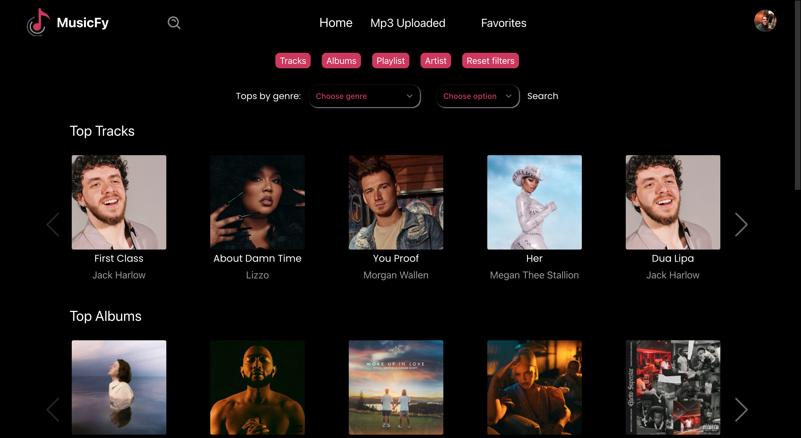
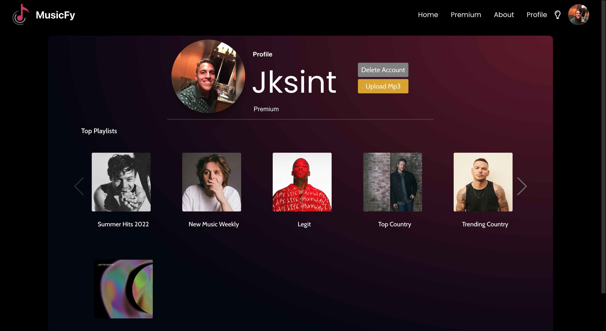
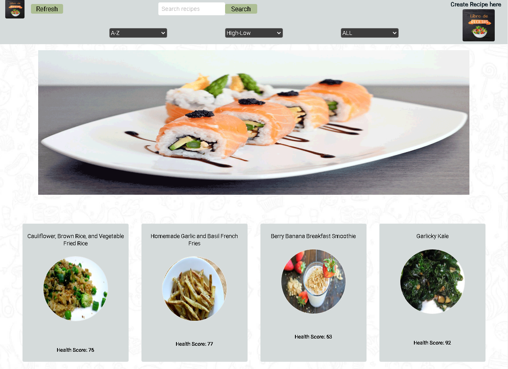
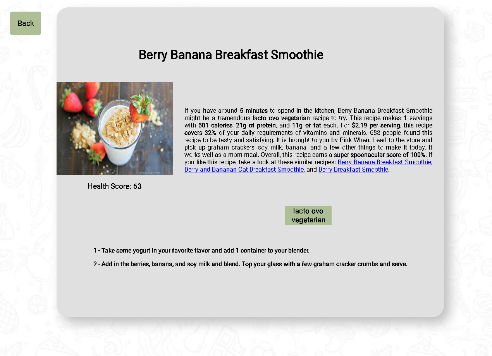
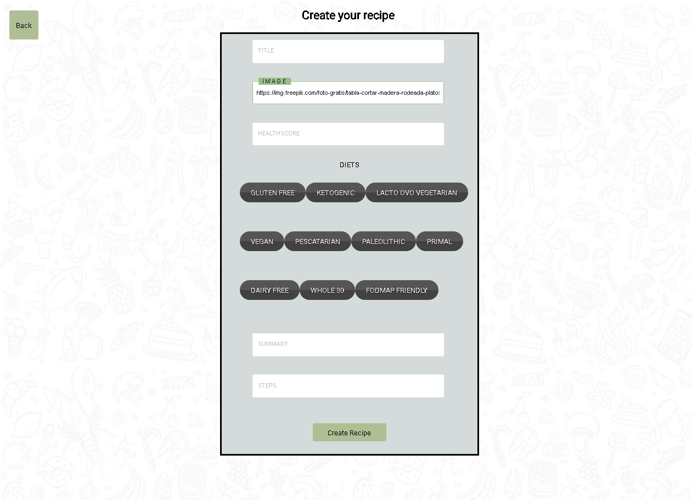

<h1 align="center">Hola 👋, Soy Eduardo Sequeira</h1>
<h3 align="center">Full Stack Developer enfocado en Front end</h3>

- 🌱 Actualmente estoy en constante aprendizaje de desarrollo web y otros lenguajes de programacion

- ✅ Buscando oportunidades y colaboraciones en el campo de desarrollo web.

- 💪 Buscando oportunidades para trabajar en entornos desafiantes y superar mis límites.

- 📫 Como contactarme **eduardoasm19@gmail.com**

- 📫 Puedes ver mi [curriculum vitae](https://drive.google.com/file/d/1y6PASzQlQsoojHC2WdxQR2Yfc_55MzCx/view?usp=sharing) para obtener mas informacion

- ✅ tambien puedes visitar mi LinkedIn  

 

 <h3>Profile Views :-</h3>  
  

 

### 🛠 &nbsp;Tecnologias

&nbsp;
&nbsp;
&nbsp;
&nbsp;
&nbsp;
&nbsp;
&nbsp;
&nbsp;
&nbsp;
&nbsp;
&nbsp;
&nbsp;
&nbsp;

 

## 
## Solo una serpiente 🐍 Devorando mis contribuciones...😭

 

## Proyectos
<h3 align="center">Musicfy App</h3>

* Musicfy. Es una App web de streaming de música, que permite como usuario escuchar on Demand, tiene sistema de registro y login tanto para el usuario como para el administrador, sistema de autenticación de usuario, una pasarela de pagos con Mercado Pago integrada, el usuario puede importar tanto su avatar de preferencia como su mp3. La app fue desarrollada por un equipo de 7 integrantes. Desarrollar esta app fue un desafio, pudimos implementar sistemas que no se habian manejado, pero con esfuerzo y dedicacion se pudo realizar.
Integrantes: 

* Link a Musicfy https://app-musicfy.vercel.app/

 

##

<h3 align="center">Recipe Book</h3>

* Recipe Book, Single Page Application realizada como proyecto individual, cuenta con barra de busqueda, filtrados, detalle de cada país y paginación. Tecnologías utilizadas: Front-End: React, Redux, CSS Puro.
JavaScript. Back-End: NodeJs, ExpressJs, Sequelize.  Deploy: Heroku y Vercel. Data Base: PostgreSQL. Control de versiones: Git/GitHub. Mi desafio en esta App fue poder conectar todos los conocimientos tanto del back como de el front.

* Link a Recipe Book https://pi-recipe-book.vercel.app/

 

